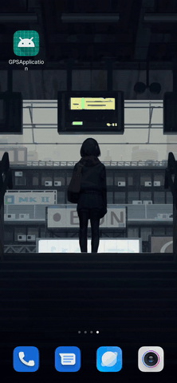

# GPSAndWebServer
 
Тестирование проводилось на Xiaomi Redmi Note 8 Pro.

На эмуляторе данные долготы и широты будут браться куда быстрее, так как они хранятся локально.

Как показано на демо сначала пользователю предлагается разрешить программе обрабатывать геоданные, если пользователь нажимает отказать, то его не пустит дальше пока он не даст свое согласие.
При нажатии на кнопку `GET LOCATION` программа обращается а API указанному ниже. И выводит результат запроса. Если данные широты и долготы еще не были показаны на экране (данных нет), то выведет соответствующее сообщение.

Используется API: https://www.bigdatacloud.com/geocoding-apis/free-reverse-geocode-to-city-api

Использованные библиотеки: 
 * для работы с геодатой `play-services-location:17.0.0`
 * для отправки запросов `okhttp:4.4.0`
 * для проверки разрешений пользователя `'com.nabinbhandari.android:permissions:3.8'`

